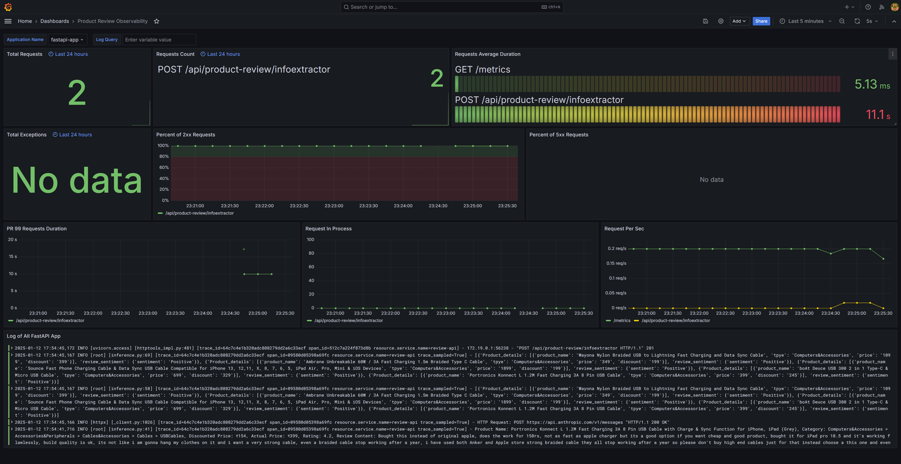
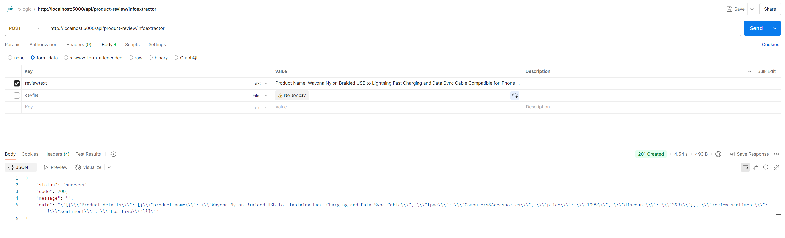

# Text Extraction and Sentiment Analysis API with Observability

This repository features a project that employs the Anthropic Sonnet 3.5 LLMM to extract key-value pairs from text and assess the sentiment of the text. The application utilizes FastAPI for API development and integrates a complete observability stack comprising OpenTelemetry, Grafana, Tempo, and Loki.

## Features

- **Key-Value Extraction**: automatically extracts structured information from unstructured text inputs.
- **Sentiment Analysis**: Analyzes the sentiment (positive, negative, or neutral) of the provided text.
- **FastAPI Endpoint**: Provides a RESTful interface for easy integration.
- **Observability**:
  - **OpenTelemetry**: Traces and metrics collection.
  - **Grafana**: Visualizes metrics and traces.
  - **Tempo**: Distributed tracing backend.
  - **Loki**: Centralized logging system.

## Technologies Used

- **Programming Language**: Python
- **LLM**: Anthropic Sonnet
- **API Framework**: FastAPI
- **Observability Stack**: OpenTelemetry, Grafana, Tempo, Loki

## Setup Instructions

### Prerequisites

Ensure you have the following installed:

- Python 3.10
- Docker (for running observability tools)
- A valid API key or access credentials for Anthropic Sonnet

### Steps

1. **Clone the Repository**

   ```bash
   git clone https://github.com/RahulJha11/product-review-sentiment.git
   cd product-review-sentiment
   ```

2. **Create a Virtual Environment**

   ```bash
   python -m venv venv
   source venv/bin/activate  # On Windows: venv\Scripts\activate
   ```

3. **Install Dependencies**

   ```bash
   pip install -r requirements.txt
   ```

4. **Set Environment Variables**
   Create a `.env` file in the root directory with the following:

   ```env
   SERVICE_NAME= Producr Review sentiment
   ANTHROPIC_KEY= "<put your anthropic ali key here>"
   APP_NAME= product Review model
   ```

5. **Run the Application**

   ```bash
   uvicorn main:app --host 0.0.0.0 --port 5000
   ```

   The API will be accessible at `http://localhost:5000`.

6. **Start the Observability Stack**
   Use the provided `docker-compose.yml` file to start Grafana, Tempo, and Loki:

   ```bash
   docker-compose up -d
   ```
   If got the error message Error response from daemon: error looking up logging plugin loki: plugin loki found but disabled, please run the following command to enable the    plugin:

   ```bash
   docker plugin enable loki
   ```

7. ### Observability Configuration

- Review the dashboard that has been predetermined Product Review Observability on Grafana: http://localhost:3000/ Log in with the following credentials: admin:admin
- Logs and traces are automatically collected by Loki and Tempo.
  

    Dashboard Screenshot

   

### API Endpoints

- **POST /extract**
  - **Description**: Extracts product information from text and determines sentiment from the input text.
  - **Request Body example**: In the request body, you can submit a text string or a CSV file as reviewtext and csvfile, respectively.
    ```
    url = "http://localhost:5000/api/product-review/infoextractor"

    payload = {'reviewtext': 'Product Name: Wayona Nylon Braided USB to Lightning Fast Charging and Data Sync Cable Compatible for iPhone 13, 12,11, X, 8, 7, 6, 5, iPad     
    Air, Pro, Mini (3 FT Pack of 1, Grey), Category: Computers&Accessories > Accessories&Peripherals > Cables&Accessories > Cables > USBCables, Discounted Price: ₹399, 
    Actual Price: ₹1,099, Rating: 4.2, Review Content: Looks durable Charging is fine tooNo complains,Charging is really fast, good product.,Till now satisfied with the 
    quality.,This is a good product . The charging speed is slower than the original iPhone cable,Good quality, would recommend,https://m.media- 
    amazon.com/images/W/WEBP_402378-T1/images/I/81---F1ZgHL._SY88.jpg,Product had worked well till date and was having no issue.Cable is also sturdy enough...Have asked for 
    replacement and company is doing the same...,Value for money'}
    files=[
    
    ]
    headers = {}
    ```
  - **Response**:
    ```json
    [{"Product_details": [{"product_name": "Wayona Nylon Braided USB to Lightning Fast Charging and Data Sync Cable", "tpye": "Computers&Accessories", "price": "1099",   
    "discount": "399"}], "review_sentiment": {"sentiment": "Positive"}}]
    ```

    Postman screenshot
    


## Contributing

Feel free to submit issues or pull requests to improve the project.


## Contact

For questions or support, please contact Rahul Jha or open an issue in the repository.

